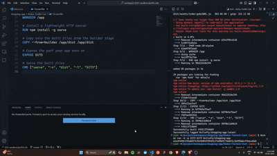
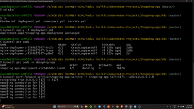

## Project 1: Online Shopping Website (React + Kubernetes)

This project is a simple online shopping website built using React. It has been containerized using Docker and deployed on a local Kubernetes cluster created with Kind. The deployment includes a multi-node setup with 1 master and 3 worker nodes.

### Technologies Used
- **Frontend**: React
- **Containerization**: Docker
- **Orchestration**: Kubernetes (Kind cluster)
- **Local Deployment**: Kind (Kubernetes IN Docker)

---

## Steps to Reproduce

1. **Dockerize the Application**:
   - Created a `Dockerfile` to containerize the React application.
   - Built the Docker image and verified that the application runs inside the container.
   - Pushed the Docker image to Docker Hub.

2. **Set Up Kubernetes Cluster**:
   - Created a local Kubernetes cluster using Kind with 1 master and 3 worker nodes.
   - Verified the cluster setup using `kubectl get nodes`.

3. **Deploy the Application**:
   - Created Kubernetes manifests for:
     - **Namespace**: To isolate the application.
     - **Deployment**: To manage the application pods.
     - **Service**: To expose the application internally.
   - Applied the manifests using `kubectl apply -f <file>.yaml`.
   - Verified the deployment using `kubectl get pods,svc -n <namespace>`.

4. **Access the Application**:
   - Accessed the application locally using the service IP and port.

---

## Screenshots and Demo

### Docker Container Running the Application

### Docker Hub Image Upload

### Application Running on Kubernetes

---

## Prerequisites

To run this project locally, you need:
- Docker installed.
- Kind installed.
- Kubectl installed.
- A Docker Hub account (optional, for pushing images).

---
